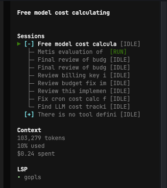

# OpenCode Session Tracker

[](https://www.npmjs.com/package/opencode-session-tracker)
[](https://www.npmjs.com/package/opencode-session-tracker)
[](https://github.com/ykocaman/opencode-session-tracker/stargazers)
[](https://github.com/ykocaman/astro-medium-loaderopencode-session-tracker/issues)

A lightweight and robust TUI plugin for [OpenCode](https://github.com/sst/opencode) that brings real-time session tracking, subagent grouping, and status monitoring directly to your sidebar.

Managing multiple active sessions and navigating between different project agents can become difficult as workflows scale. `opencode-session-tracker` solves this by providing a clean, interactive tree-view, allowing you to instantly see what your agents are doing and switch contexts seamlessly.



## Features

- **Interactive Sidebar:** Click on any session to instantly switch to it.
- **Subagent Grouping:** Subagents are neatly nested under their parent sessions like a folder tree. You can expand/collapse them by clicking the `[+]` or `[-]` icons.
- **Smart Active Pop-out:** Even if a parent session is collapsed, any subagent that is currently doing work (running, waiting, or asking for permission) will automatically pop out so you don't miss it!
- **Real-Time Status Indicators:** 
  - `[RUN]` (Green): Agent is actively running/generating.
  - `[IDLE]` (Gray): Agent is done and waiting.
  - `[WAIT]` (Yellow): Agent is retrying or waiting on an internal process.
  - `[ASK]` (Magenta): Agent is waiting for you to answer a question.
  - `[PERM]` (Magenta): Agent is waiting for your permission to run a command.

## Installation

1. Run the official OpenCode plugin installation command:
   ```bash
   opencode plugin opencode-session-tracker --global
   ```

2. Restart OpenCode!

## Development

If you want to tweak this plugin yourself:
1. Clone this repository.
2. Run `npm install` to grab the dependencies.
3. Edit `src/index.tsx`.
4. Run `npm run build` to compile the TSX into the `dist` folder.
5. Point your `tui.json` to the absolute path of this cloned repo.
