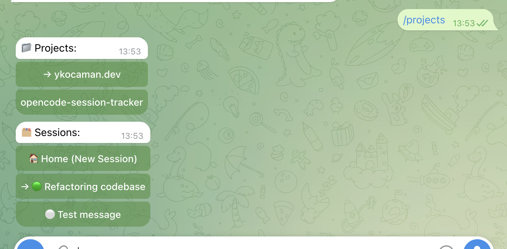
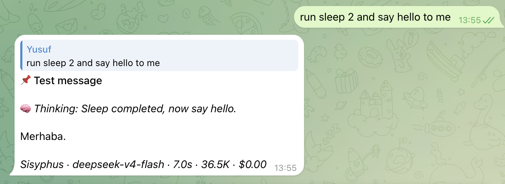

# OpenCode Session Tracker

[](https://www.npmjs.com/package/opencode-session-tracker)
[](https://www.npmjs.com/package/opencode-session-tracker)
[](https://github.com/ykocaman/opencode-session-tracker/stargazers)

A lightweight, robust TUI sidebar extension and interactive **Telegram Integration** for [OpenCode](https://github.com/sst/opencode) that brings real-time session tracking, multi-process routing, and remote monitoring directly to your terminal and phone.

---

## 📱 Telegram Integration

Monitor and drive your terminal agents remotely from your mobile device. When active, you can send instructions, receive live HTML-styled updates, answer interactive questions, and authorize agent commands without touching your computer.

<p align="center">
  
  Projects & sessions — select an active session to monitor or interact with.</p>

<br>

<p align="center">
  
Live prompt tracking — follow your agent's thinking and tool calls in real-time, with buttons to approve or deny commands.</p>

* **Live Status Streaming:** Follow your agent's thinking process and tool executions formatted cleanly in real-time.
* **Interactive Approvals:** Answer questions and authorize terminal commands (`allow` or `deny` permissions) directly via Telegram buttons.
* **Cross-Process Routing:** Multi-window support automatically syncs session views and routes prompts to the correct terminal window.
* **Zero Overhead:** Idle state polling is fully cached and throttled to respect Telegram rate-limits.

> [!TIP]
> To get started with the mobile control bot, check out the [Telegram Setup Guide](docs/telegram-setup.md).

---

## 🖥️ TUI Sidebar Features

<p align="center">
  
</p>

* **Session Hierarchies:** Neatly groups subagents nested under their parent sessions like folder trees. Toggle expand/collapse with `[+]` or `[-]`.
* **Smart Active Pop-out:** collapsing parent folders won't hide running processes. Active subagents doing work pop out automatically.
* **Visual Status Tags:**
  * `[RUN]` (Green): Agent is actively running a tool or generating code.
  * `[IDLE]` (Gray): Agent completed its task and is idle.
  * `[WAIT]` (Yellow): Agent is waiting or retrying an internal process.
  * `[ASK]` (Magenta): Agent is waiting for you to answer a question.
  * `[PERM]` (Magenta): Agent is waiting for permission to execute a command.

---

## 📥 Installation

Install globally using the official OpenCode plugin command:

```bash
opencode plugin opencode-session-tracker --global
```

Restart OpenCode, and the sidebar will load automatically.

---

## 🔧 Developer Setup

If you want to customize or develop the plugin locally:

1. Clone the repository and install dependencies:
   ```bash
   git clone https://github.com/ykocaman/opencode-session-tracker.git
   cd opencode-session-tracker
   npm install
   ```
2. Build the plugin:
   ```bash
   npm run build
   ```
3. Load the plugin locally in OpenCode by adding the absolute path of this folder to your `tui.json` configuration file.
