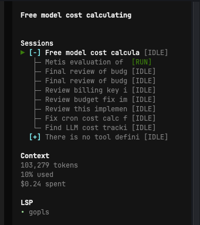
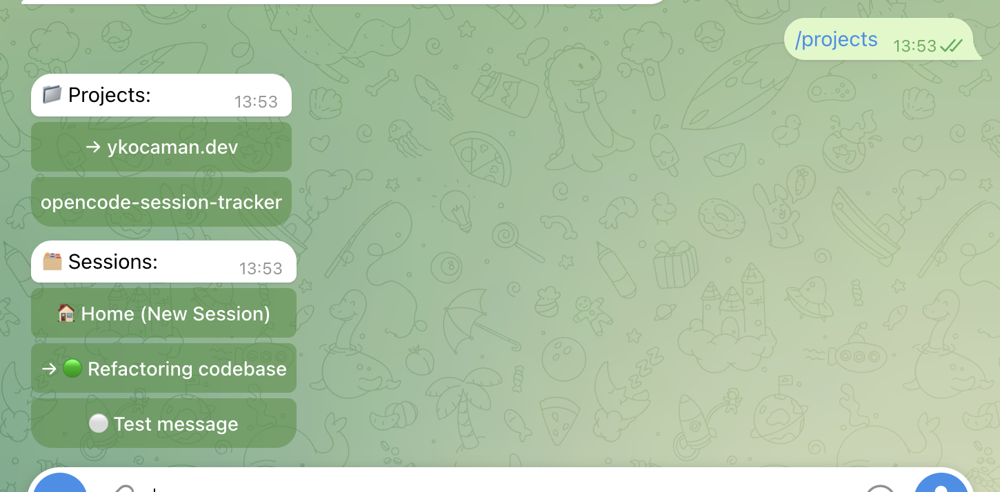
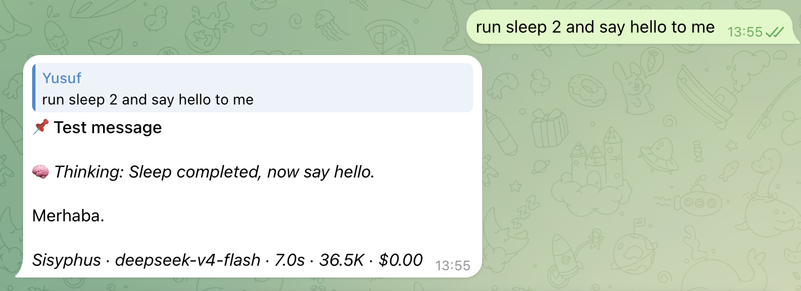

# OpenCode Session Tracker

[](https://www.npmjs.com/package/opencode-session-tracker)
[](https://www.npmjs.com/package/opencode-session-tracker)
[](https://github.com/ykocaman/opencode-session-tracker/stargazers)

One session tracker for [OpenCode](https://github.com/sst/opencode), two surfaces: a **TUI sidebar** in your terminal and a **Telegram remote control** on your phone. Both stay in sync automatically — pick up a session in one place, and it's right where you left it in the other.

<p align="center">
  
</p>

---

## What you get

* **One session list, everywhere.** Sessions and subagents are tracked in real time and shown identically in the sidebar and in Telegram's `/sessions` and `/history`. Active and archived sessions are always bucketed the same way on both sides.
* **Session hierarchies.** Subagents nest under their parent session like folders. Toggle `[+]`/`[-]` to expand or collapse; active subagents pop out automatically even while their parent is collapsed.
* **Live status everywhere.** The same status — running, waiting, idle, asking a question, waiting on a permission — is reflected as a colored tag in the sidebar and as a live-updating message in Telegram.
* **Remote control from your phone.** Send prompts, follow your agent's thinking and tool calls as they happen, and approve or deny permission requests and interactive questions — all via Telegram buttons, without touching your keyboard.
* **Cross-window / cross-project routing.** Multiple OpenCode windows are tracked together. Telegram routes prompts to the correct project's terminal window and follows you as you switch sessions.
* **Instance management from Telegram.** List running projects, launch OpenCode in a project that isn't running, or close/restart the current instance — all from `/projects`.
* **History, your way.** Sessions idle for 24h automatically move to History. Don't want to wait? Cmd+click (Alt+click on Windows/Linux) a session in the sidebar to archive it to History immediately.

---

## 🖥️ TUI Sidebar

* **Session Hierarchies:** Subagents nest under their parent session like folder trees. Toggle expand/collapse with `[+]` or `[-]`.
* **Smart Active Pop-out:** Collapsing a parent won't hide running work — active subagents pop out automatically.
* **Cmd/Alt+click to archive:** Cmd+click (Alt+click on Windows/Linux) any session to move it into History right away, without waiting for the 24h auto-expiry. (Plain right-click gets intercepted by your terminal's own context menu, and ctrl+click gets remapped to right-click by macOS itself — neither reaches the app reliably.)
* **Visual Status Tags:**
  * `[RUN]` (Green): Agent is actively running a tool or generating code.
  * `[IDLE]` (Gray): Agent completed its task and is idle.
  * `[WAIT]` (Yellow): Agent is waiting or retrying an internal process.
  * `[ASK]` (Magenta): Agent is waiting for you to answer a question.
  * `[PERM]` (Magenta): Agent is waiting for permission to execute a command.

---

## 📱 Telegram Remote Control

<p align="center">
  
  Projects & sessions — select an active session to monitor or interact with.</p>

<br>

<p align="center">
  
Live prompt tracking — follow your agent's thinking and tool calls in real-time, with buttons to approve or deny commands.</p>

* **Live Status Streaming:** Follow your agent's thinking process and tool executions, formatted cleanly, in real-time.
* **Interactive Approvals:** Answer questions and authorize terminal commands (`allow` or `deny` permissions) directly via Telegram buttons.
* **Session & History Browsing:** `/sessions` lists everything currently active; `/history` lists everything archived — exactly matching what the sidebar shows.
* **Project Control:** `/projects` lists every known OpenCode project, shows which are online, and lets you launch, close, or restart an instance remotely.
* **Cross-Process Routing:** Multi-window support automatically syncs session views and routes prompts to the correct terminal window.
* **Zero Overhead:** Idle-state polling is fully cached and throttled to respect Telegram rate limits.

> [!TIP]
> To get started with the mobile control bot, check out the [Telegram Setup Guide](docs/telegram-setup.md).

---

## 📥 Installation

Install globally using the official OpenCode plugin command:

```bash
opencode plugin opencode-session-tracker --global
```

Restart OpenCode, and the sidebar will load automatically. Telegram control activates on top of it as soon as you add a `telegram.json` config — see the [setup guide](docs/telegram-setup.md).

---

## 🔧 Developer Setup

If you want to customize or develop the plugin locally:

1. Clone the repository and install dependencies:
   ```bash
   git clone https://github.com/ykocaman/opencode-session-tracker.git
   cd opencode-session-tracker
   npm install
   ```
2. Build the plugin:
   ```bash
   npm run build
   ```
3. Load the plugin locally in OpenCode by adding the absolute path of this folder to your `tui.json` configuration file.
